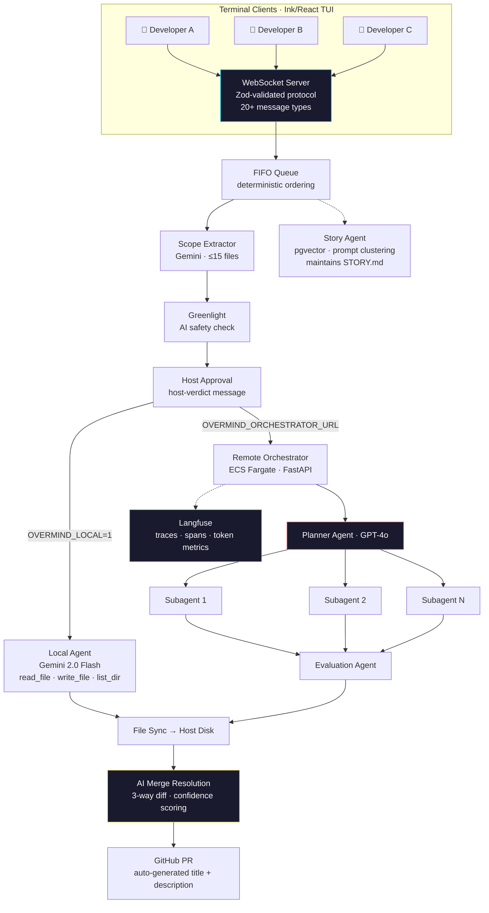

<div align="center">


# OVERMIND

### The Multiplayer AI Coding Terminal

**One session. Multiple developers. One AI pipeline. Zero merge conflicts.**

[](https://github.com/atharva789/Overmind/actions)
[](https://nodejs.org)
[](https://www.typescriptlang.org)
[](https://python.org)
[](LICENSE)

[](https://github.com/atharva789/Overmind)
[](https://langfuse.com)
[](https://aws.amazon.com/ecs/)
[](https://www.terraform.io)
[](https://github.com/atharva789/Overmind)
[](https://github.com/pgvector/pgvector)

[Quick Start](#quick-start) · [Architecture](#architecture) · [Technical Depth](#technical-depth) · [Deploy](#deployment) · [Live Demo](https://landing-lake-eight-64.vercel.app)

</div>

---

## The Problem

AI coding tools generated **$15B+ in revenue** last year. GitHub Copilot, Cursor, Devin — every one of them is **single-player**.

When 5 engineers on the same team each use their own AI coding tool:

| What happens | Cost |
|---|---|
| No shared context | Agents duplicate work across the same files |
| No coordination | Conflicting changes pile up silently |
| No merge resolution | Engineers manually resolve AI-generated conflicts |
| No visibility | "Who told the AI to change this?" becomes a daily question |

The result: teams spend **more time coordinating AI outputs** than writing code. The $45B developer tools market has a multiplayer-shaped hole — the same gap Figma exploited in design ($20B valuation).

## The Solution

Overmind is a **multiplayer terminal** where your entire team submits prompts to a shared AI session. A host runs `overmind host` in their project directory. Teammates join with a 4-letter party code. Every prompt flows through a deterministic, auditable pipeline — from scope extraction to execution to merge resolution to PR creation.

No IDE plugins. No cloud lock-in. One `npm install`, and your team is shipping together.

## See It In Action

```
$ overmind host --port 4444
🔌 Server listening on :4444
📋 Party code: XKRF — share this with your team (0/8 slots)

[XKRF] alice joined (2/8 members)
[XKRF] bob joined (3/8 members)

alice> Add rate limiting middleware to all /api routes — 100 req/min per IP

  ┌─ Scope ──────────────────────────────────────────────────────────┐
  │ Affected: src/middleware/rateLimit.ts, src/routes/api/users.ts   │
  │           src/routes/api/posts.ts, tests/rateLimit.test.ts       │
  │ Complexity: moderate                                              │
  └──────────────────────────────────────────────────────────────────┘
  ✅ Greenlight: safe — no destructive operations detected
  ✅ Host approved

  ┌─ Execution (3 parallel agents) ──────────────────────────────────┐
  │ Task 1/3  Create rate-limit middleware          ██████████ done   │
  │   💭 Using sliding window counter pattern...                      │
  │   🔧 write_file  src/middleware/rateLimit.ts                      │
  │ Task 2/3  Wire into Express route handlers      ██████████ done   │
  │   🔧 read_file   src/routes/api/index.ts                         │
  │   🔧 write_file  src/routes/api/index.ts                         │
  │   🔧 write_file  src/routes/api/users.ts                         │
  │ Task 3/3  Add integration tests                 ██████████ done   │
  │   🔧 write_file  tests/rateLimit.test.ts                         │
  └──────────────────────────────────────────────────────────────────┘
  ✅ Evaluation passed · 4 files changed · PR #42 opened

bob> Refactor auth module from sessions to JWT
  Scope: src/auth/session.ts → src/auth/jwt.ts (+3 files) · complex
  ...executing concurrently while alice's changes merge cleanly...
```

Every step — scope, greenlight, execution, thinking, tool calls, merge — streams to the TUI in real time over WebSocket.

## How Competitors Compare

| Capability | Copilot | Cursor | Devin | **Overmind** |
|---|:---:|:---:|:---:|:---:|
| Real-time multiplayer sessions | ❌ | ❌ | ❌ | **✅ up to 8 devs** |
| Shared execution context | ❌ | ❌ | ❌ | **✅** |
| AI merge conflict resolution | ❌ | ❌ | ❌ | **✅ with confidence scoring** |
| Human-in-the-loop approval gate | — | — | ❌ | **✅ host-verdict** |
| Scope-bounded execution | ❌ | ❌ | ❌ | **✅ max 15 files** |
| Multi-agent decomposition | ❌ | ❌ | ✅ | **✅ planner → N subagents** |
| Real-time agent streaming | ❌ | ❌ | Partial | **✅ 8 event types** |
| LLM observability (Langfuse) | ❌ | ❌ | ❌ | **✅ traces + spans** |
| Feature clustering (pgvector) | ❌ | ❌ | ❌ | **✅** |
| Self-hostable | ❌ | ❌ | ❌ | **✅** |
| Automatic PR creation | ❌ | ❌ | ✅ | **✅** |

## Architecture

```
┌──────────────────────────────────────────────────────────────────────────────────┐
│                              OVERMIND ARCHITECTURE                                │
│                                                                                   │
│  Developer A ──┐                                                                  │
│  Developer B ──┼──► WebSocket ──► FIFO Queue ──► Scope Extractor                 │
│  Developer C ──┘    (Zod-validated)              (Gemini, ≤15 files)             │
│                                                       │                           │
│                                          ┌────────────┴────────────┐              │
│                                          ▼                         ▼              │
│                                    Greenlight                Story Agent           │
│                                    (AI safety)               (pgvector            │
│                                          │                    clustering)          │
│                                          ▼                                        │
│                                   Host Approval                                   │
│                                   (host-verdict)                                  │
│                                          │                                        │
│                           ┌──────────────┴──────────────┐                         │
│                           ▼                              ▼                        │
│                     Local Agent                  Remote Orchestrator               │
│                     (Gemini 2.0 Flash)           (ECS Fargate)                    │
│                     • read_file                        │                           │
│                     • write_file                 Planner Agent                     │
│                     • list_dir                   (GPT-4o)                          │
│                           │                      ┌──┼──┐                          │
│                           │                     S1  S2  S3  ← Parallel Subagents  │
│                           │                      └──┼──┘                          │
│                           │                    Evaluation Agent                    │
│                           └──────────┬───────────────┘                            │
│                                      ▼                                            │
│                              File Sync to Host                                    │
│                                      │                                            │
│                              Merge Resolution                                     │
│                              (3-way + confidence)                                 │
│                                      │                                            │
│                              ┌───────┴───────┐                                    │
│                              ▼               ▼                                    │
│                         Commit &        STORY.md                                  │
│                         Open PR         Updated                                   │
│                                                                                   │
│  ── Observability ──────────────────────────────────────────────────────────────  │
│  Langfuse: root trace per run → planning span → subagent spans → tool events     │
│  CloudWatch: /ecs/overmind log group                                              │
│  Streaming: 8 event types → WebSocket → TUI (submitter + host only)              │
└──────────────────────────────────────────────────────────────────────────────────┘
```



## Technical Depth

### Type-Safe WebSocket Protocol

Every message crossing the wire is validated against Zod discriminated unions. 20+ message types cover the full lifecycle — from `join-ack` through `execution-agent-thinking` to `merge-complete`. Invalid messages are logged and dropped, never propagated.

```typescript
// src/shared/protocol.ts — 20+ validated message types
export const ServerMessageSchema = z.discriminatedUnion("type", [
  JoinAckMessage,           MemberJoinedMessage,       MemberLeftMessage,
  PromptQueuedMessage,      PromptGreenlitMessage,     PromptRedlitMessage,
  PromptApprovedMessage,    PromptDeniedMessage,       HostReviewRequestMessage,
  FeatureCreatedMessage,    ActivityMessage,            ErrorMessage,
  ExecutionStatusMessage,   MemberExecutionUpdateMessage,
  MemberExecutionCompleteMessage,  MergeUpdateMessage,
  MergeCompleteMessage,     MergeErrorMessage,         ExecutionPlanReadyMessage,
  ExecutionAgentUpdateMessage,     ExecutionToolActivityMessage,
  ExecutionAgentThinkingMessage,
]);
```

### Privacy Invariant

Prompt content is visible **only** to the submitter and the host. It is never broadcast to other party members — enforced server-side in `Party.sendTo()`. This is a critical security property maintained across every code path.

### Scope-Bounded Execution

Before any file is touched, Gemini analyzes the prompt against the full file tree and returns a structured `ScopeResult`:

```typescript
// src/server/execution/scope.ts
interface ScopeResult {
  affectedFiles: string[];   // max 15 files
  complexity: "simple" | "moderate" | "complex";
}
```

This constrains the agent's blast radius. A prompt that says "refactor everything" still operates on at most 15 files.

### Multi-Agent Orchestration (Remote)

The ECS orchestrator decomposes complex prompts through a planner → subagent → evaluation pipeline:

1. **Planner** (GPT-4o): Breaks the prompt into named subtasks with dependencies
2. **Subagents** (parallel): Each gets isolated workspace + tools (`read_file`, `write_file`, `list_dir`, `execute_command`)
3. **Evaluation**: Reviews all subagent outputs, can accept (`finish`) or trigger re-planning (`draft-plan`)
4. **Loop**: Up to `MAX_AGENT_ROUNDS` iterations until evaluation accepts

Every stage emits streaming events over WebSocket — the TUI renders agent thinking, tool calls, and progress in real time.

### AI Merge Resolution

When concurrent prompts modify overlapping files, the merge pipeline:

1. Detects conflicts via `git diff`
2. Reads `STORY.md` for cross-prompt context
3. Resolves each file with AI (three-way: base, ours, theirs) + **confidence scoring**
4. Low-confidence resolutions are flagged — never silently applied
5. Commits to a new branch and opens a GitHub PR with AI-generated title and description

### Langfuse Observability

Every remote execution produces a hierarchical trace:

```
Root Trace (run_id, session_id, tags)
├── Planning Span (query_length, task_count)
├── Subagent Span (task_index, task_name)
│   ├── Tool Use Events
│   └── Agent Thinking Events
├── Subagent Span ...
└── Evaluation Span (decision: finish | draft-plan)
```

Token counts, latency, and cost are auto-captured via the Langfuse `AsyncOpenAI` drop-in wrapper. Filter by session, tag, or trace to debug any execution.

### Feature Clustering (pgvector)

PostgreSQL with pgvector stores prompt embeddings. A story agent clusters related prompts into features:

```
Tables: features, queries, code_chunks
Operations: assign_existing | create_new | reject
Output: STORY.md — living document of what the team has built
```

This gives agents cross-prompt context. When Alice adds auth and Bob adds auth tests, the story agent clusters them into one feature — so subsequent prompts have full context.

### Real-Time Event Streaming

Eight event types flow from orchestrator to TUI:

| Event | Data | Rendered As |
|---|---|---|
| `plan-ready` | Task list with names | Multi-panel task view |
| `agent-spawned` | task_index, task_name | "Spawned" status indicator |
| `tool-use` | tool_name, task_index | 🔧 tool activity line |
| `tool-result` | success, output (truncated) | ✅/❌ result indicator |
| `agent-thinking` | content (≤300 chars) | 💭 italic thinking text |
| `agent-finished` | summary, files_changed | Completion with file list |
| `run-complete` | final result | Session complete |
| `run-error` | error detail | Error display |

## Quick Start

**Requirements:** Node.js 20+, npm

```bash
# Install globally from GitHub
npm install -g github:atharva789/Overmind

# Or: clone and link
git clone git@github.com:atharva789/Overmind.git
cd Overmind && npm install && npm run build && npm link
```

```bash
# Set your API key
export GEMINI_API_KEY="your-key"

# Host a session (from your project directory)
overmind host --port 4444
# → Party code: XKRF (share this)

# Join from another terminal (or another machine)
overmind join XKRF --server localhost --port 4444 -u "alice"
```

### Remote Execution (ECS Fargate)

```bash
# Point at your deployed orchestrator
export OVERMIND_ORCHESTRATOR_URL="http://your-alb.us-east-2.elb.amazonaws.com"

# Host with remote execution
overmind host --port 4444
```

### Expose Over the Internet

```bash
# Terminal 1: host
overmind host --port 4444

# Terminal 2: tunnel
ngrok tcp 4444
# Share the ngrok host + port + party code with your team
```

## Deployment

### Infrastructure (Terraform)

```bash
cd infra && terraform init && terraform apply
```

Provisions a production-ready stack:

| Resource | Name | Purpose |
|---|---|---|
| ECS Cluster | `overmind-ecs-cluster` | Container orchestration |
| ECS Service | `overmind-orchestrator` | Fargate tasks (auto-restart) |
| Application Load Balancer | `overmind-alb` | HTTP ingress, health checks |
| ALB Target Group | `overmind-tg` | Port 8000 routing |
| ECR Repository | `overmind-orchestrator-repo` | Docker image registry |
| CloudWatch Log Group | `/ecs/overmind` | Centralized logging |
| Security Groups | `overmind-ecs-sg`, `overmind-alb-sg` | Network isolation |
| SSM Parameters | `/overmind/*` | Secret management |

### CI/CD (GitHub Actions)

Every push to `thorba-iterate` or `v*` tag:
1. Authenticates to ECR via OIDC
2. Builds Docker image (`modal/.dockerfile`, `linux/amd64`)
3. Tags as `sha-<commit>` + `latest`
4. Pushes to ECR — ECS pulls on next deployment

```bash
# Force redeploy with latest image
aws ecs update-service \
  --cluster overmind-ecs-cluster \
  --service overmind-orchestrator \
  --force-new-deployment \
  --region us-east-2
```

### Environment Variables

| Variable | Required | Purpose |
|---|:---:|---|
| `GEMINI_API_KEY` | ✅ | Gemini API for local execution + scope extraction |
| `OVERMIND_LOCAL` | — | Set to `1` for local execution mode |
| `OVERMIND_ORCHESTRATOR_URL` | — | ALB endpoint for remote execution |
| `OPENAI_API_KEY` | — | GPT-4o for remote planner/subagents |
| `DATABASE_URL` | — | PostgreSQL + pgvector for story clustering |
| `LANGFUSE_PUBLIC_KEY` | — | Langfuse observability |
| `LANGFUSE_SECRET_KEY` | — | Langfuse observability |

## Tech Stack

| Layer | Technology |
|---|---|
| CLI & TUI | TypeScript, Commander, Ink (React for terminal) |
| Server | Node.js WebSocket, Zod validation |
| Local Execution | Gemini 2.0 Flash, tool-calling loop |
| Remote Execution | Python FastAPI, GPT-4o, parallel subagents |
| Infrastructure | AWS ECS Fargate, ALB, ECR, Terraform |
| Database | PostgreSQL + pgvector |
| Observability | Langfuse (traces, spans, token metrics) |
| CI/CD | GitHub Actions → ECR → ECS |

---

<div align="center">

**Overmind: where your entire team ships through one AI pipeline — in real time.**

[Get Started](#quick-start) · [Live Site](https://landing-lake-eight-64.vercel.app) · [Star on GitHub](https://github.com/atharva789/Overmind) · [Feedback](https://docs.google.com/forms/d/e/1FAIpQLSfbYdIqiNQT3KLJZRsKJojx6VJsrhSQloBVfRzn61H6nnCuxw/viewform)

</div>
