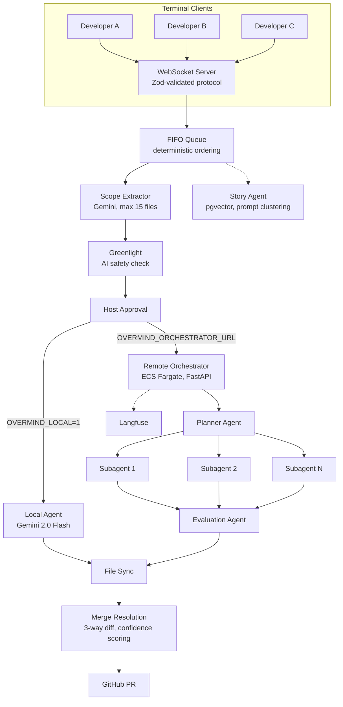

# Overmind

Multiplayer AI coding terminal -- multiple developers share a WebSocket session, queue prompts against one repo, and an AI agent executes the approved changes while streaming progress to every connected TUI.

## Status

Read this before any capability claim further down.

| Area | State |
| --- | --- |
| WebSocket session management | Implemented. Zod-validated protocol, 20+ message types, up to 8 members. |
| Terminal UI (Ink/React) | Implemented. Prompt input, execution view, review panel, activity feed, diff blocks. |
| Local AI execution | Implemented. Gemini 2.0 Flash with tool-calling loop (`read_file`, `write_file`, `list_dir`). |
| Scope extraction | Implemented. Gemini analyzes prompt against file tree, constrains to 15 files max. |
| Host approval flow | Implemented. Greenlight safety check, then host-verdict before execution begins. |
| Remote orchestrator | Code exists (`modal/`). FastAPI service, planner + parallel subagents. CI builds and pushes Docker image to ECR. Not verified end-to-end in production. |
| AI merge resolution | Code exists (`src/server/merge/`). 3-way diff with confidence scoring, auto PR creation via `simple-git`. |
| Story agent (pgvector) | Code exists (`src/server/story/`). Clusters prompts into features using embeddings. |
| Langfuse observability | Dependency exists in `modal/requirements.txt`. Not in the local execution path. No env vars in `.env.example` -- likely configured via SSM or task environment. |
| Terraform infra | Defined (`infra/`). ECS Fargate, ALB, ECR, CloudWatch, SSM. |
| Tests | 4 JS test files covering orchestrator internals (file-lock, file-sync, index, result). 1 Python test file for the remote orchestrator. Protocol, merge resolver, story agent, and Gemini agent loop have no tests. |
| CI | Path-filtered to `modal/**` only. Builds Docker image and pushes to ECR. Does not run tests. TypeScript changes get no CI. |

## Architecture


```mermaid
graph TB
    subgraph Clients["Terminal Clients"]
        A["Developer A"] --> WS
        B["Developer B"] --> WS
        C["Developer C"] --> WS
    end

    WS["WebSocket Server<br/>Zod-validated protocol"] --> Q["FIFO Queue<br/>deterministic ordering"]
    Q --> SC["Scope Extractor<br/>Gemini, max 15 files"]
    SC --> GL["Greenlight<br/>AI safety check"]
    GL --> HA["Host Approval"]

    HA -->|"OVERMIND_LOCAL=1"| LA["Local Agent<br/>Gemini 2.0 Flash"]
    HA -->|"OVERMIND_ORCHESTRATOR_URL"| RO["Remote Orchestrator<br/>ECS Fargate, FastAPI"]

    RO --> PL["Planner Agent"]
    PL --> S1["Subagent 1"] & S2["Subagent 2"] & S3["Subagent N"]
    S1 & S2 & S3 --> EV["Evaluation Agent"]

    LA & EV --> FS["File Sync"]
    FS --> MR["Merge Resolution<br/>3-way diff, confidence scoring"]
    MR --> PR["GitHub PR"]

    Q -.-> SA["Story Agent<br/>pgvector, prompt clustering"]
    RO -.-> LF["Langfuse"]
```

## Run it

Requirements: Node.js 20+, npm.

```bash
git clone git@github.com:atharva789/Overmind.git
cd Overmind
npm install
npm run build
npm link          # puts `overmind` on your PATH
```

Copy and fill in the environment file:

```bash
cp .env.example .env
# At minimum, set GEMINI_API_KEY
```

Host a session:

```bash
overmind host --port 4444
# Prints a party code (e.g. XKRF)
```

Join from another terminal:

```bash
overmind join XKRF --server localhost --port 4444 -u "alice"
```

For remote execution, set `OVERMIND_ORCHESTRATOR_URL` to point at the FastAPI service running from `modal/`. For production deployment, see `infra/` (Terraform) and `.github/workflows/workflow.yml` (CI).

### Run tests

```bash
npm test                  # JS orchestrator tests
npm run test:modal        # Python orchestrator tests (requires venv)
```

## Environment variables

See `.env.example` for the full list. The important ones:

| Variable | Purpose |
| --- | --- |
| `GEMINI_API_KEY` | Required. Powers local execution and scope extraction. |
| `OVERMIND_LOCAL` | Set to `1` for local execution mode. |
| `OVERMIND_ORCHESTRATOR_URL` | ALB endpoint for remote execution (ECS Fargate). |
| `OVERMIND_DATABASE_URL` | PostgreSQL connection string for pgvector story clustering. |
| `OVERMIND_LLM_URL` | OpenAI-compatible endpoint for orchestrator and merge resolver. Falls back to `OPENAI_API_KEY` if unset. |
| `GITHUB_TOKEN` | Merge resolver uses this for PR creation. |
| `NGROK_AUTHTOKEN` | Optional. Expose a local session over the internet. |

## Repository layout

```
src/
  cli.ts                    # CLI entry point (Commander)
  client/                   # Ink TUI components
  server/
    index.ts                # WebSocket server
    party.ts                # Session/party management
    execution/              # Scope extraction, Gemini agent, tools
    merge/                  # 3-way diff, confidence scoring, GitHub PR
    orchestrator/           # Remote orchestrator client, file sync
    story/                  # pgvector story agent
  shared/
    protocol.ts             # Zod discriminated union, 20+ message types
modal/                      # Python FastAPI remote orchestrator
infra/                      # Terraform (ECS, ALB, ECR, CloudWatch)
landing/                    # Next.js marketing site (Vercel)
tests/                      # JS + Python tests
```

