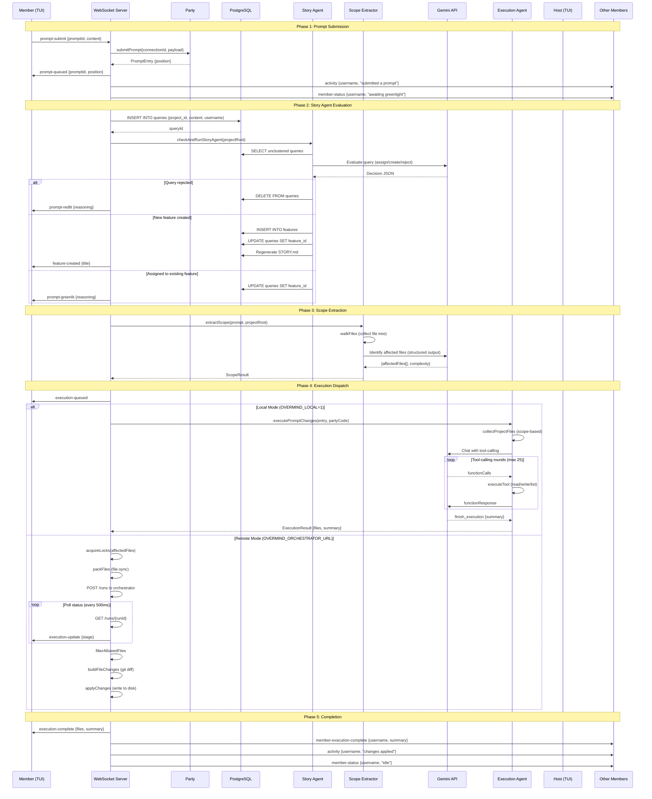
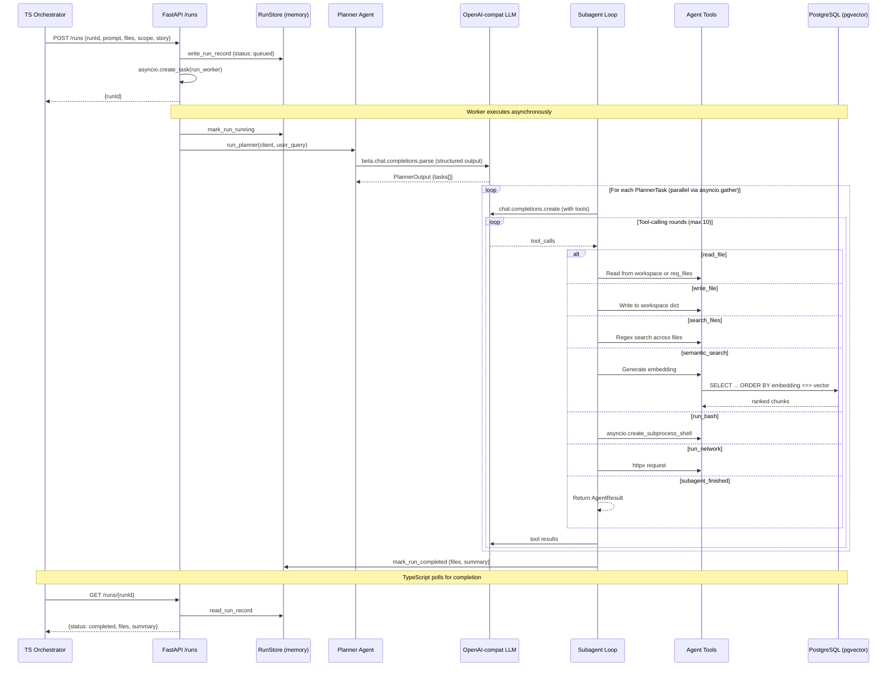
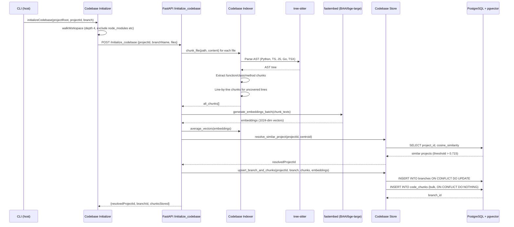
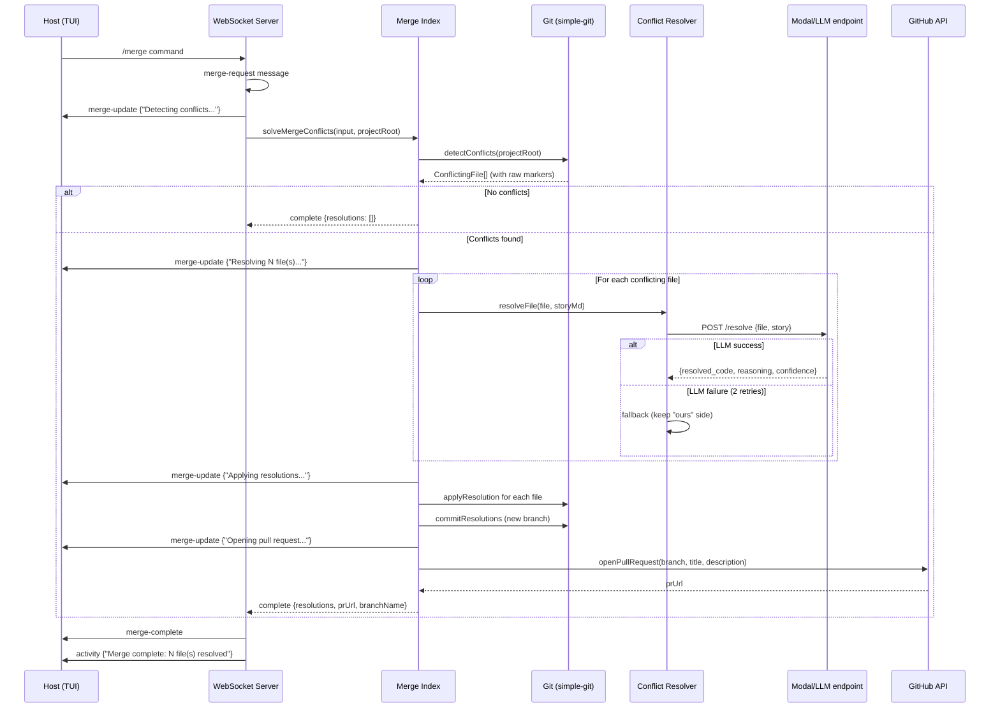
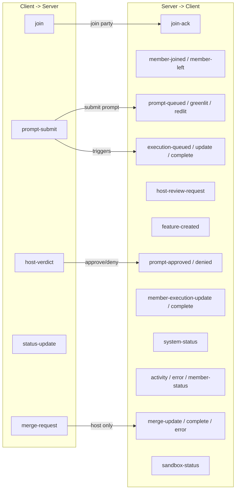

# Data Flow

This document traces how data moves through the Overmind system for the three critical flows: prompt submission and execution, codebase indexing, and merge conflict resolution.

## 1. Prompt Submission and Execution (Full Pipeline)

This is the primary data flow. A member submits a prompt, it is evaluated, the host approves it, and an AI agent executes code changes.

## 2. Remote Execution (Python Orchestrator Detail)

When using the remote orchestrator, the Python FastAPI service manages the actual LLM interactions.

## 3. Codebase Indexing Flow

On host startup, the TypeScript side sends all project files to the Python backend for AST-aware chunking and embedding.

## 4. Merge Conflict Resolution

The host triggers merge resolution via the `/merge` slash command.

## 5. WebSocket Message Flow

All client-server communication uses Zod-validated discriminated unions.

