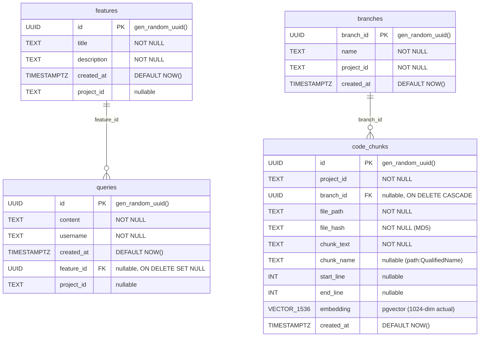
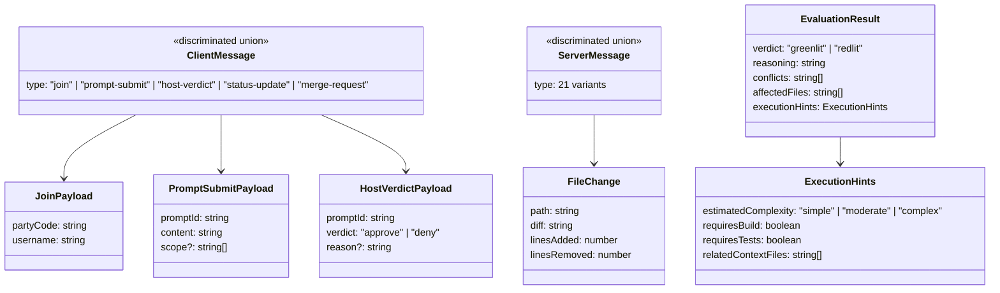
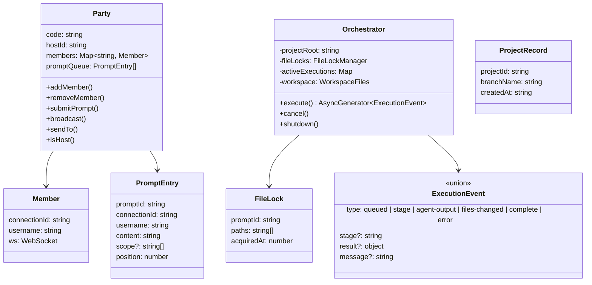
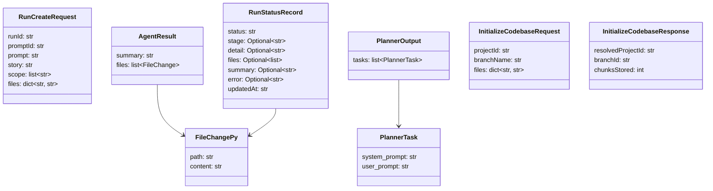
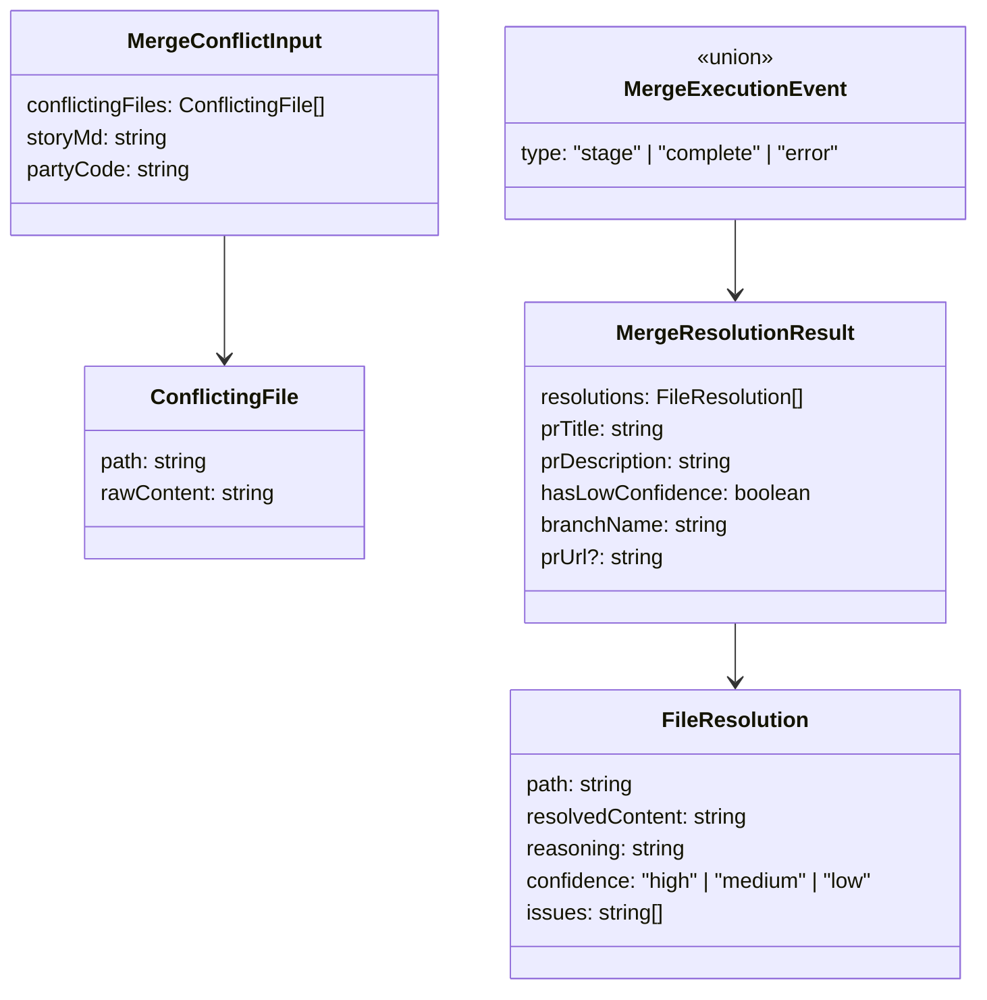
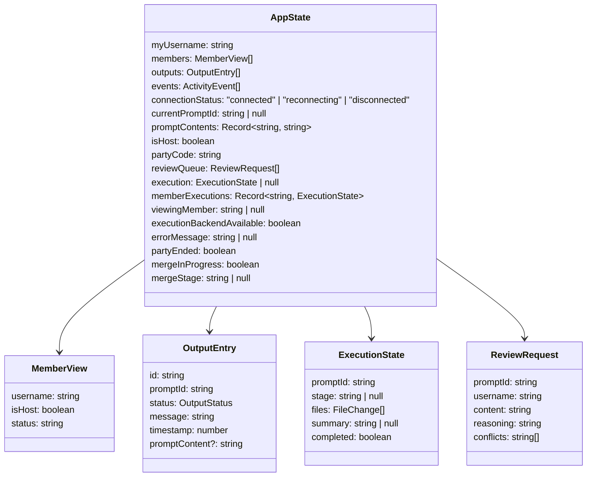

# Data Model

This document describes all data entities in Overmind, including database tables, TypeScript types, Python models, and their relationships.

## Database Schema (PostgreSQL + pgvector)

The database is optional. When `OVERMIND_DATABASE_URL` is set, the server initializes these tables via idempotent DDL in `src/server/db.ts`.

### Table Details

**features** -- Tracks feature clusters detected by the Story Agent. Each feature groups related user prompts.
- `project_id`: Derived from git remote URL or directory name via `deriveProjectId()`
- Created when Story Agent classifies a query as "create_new"

**queries** -- Every user prompt submitted through the WebSocket server. Linked to features after Story Agent clustering.
- `feature_id`: NULL until clustered, or deleted entirely if rejected as off-topic
- `content`: The raw prompt text (privacy-sensitive, never broadcast)

**branches** -- Tracks git branches for codebase indexing. One branch per (project_id, name) pair.
- UNIQUE constraint on `(project_id, name)`

**code_chunks** -- AST-aware code chunks with vector embeddings for semantic search.
- `chunk_name`: Qualified name like `src/foo.py:ClassName.method` or `src/foo.py:42` for line-level chunks
- `embedding`: 1024-dimensional vector from BAAI/bge-large-en-v1.5 (schema says VECTOR(1536) but actual model is 1024-dim)
- UNIQUE INDEX on `(project_id, file_path, start_line)`
- INDEX on `branch_id`

### Indexes

| Index | Table | Columns | Type |
|-------|-------|---------|------|
| `code_chunks_branch_id_idx` | code_chunks | branch_id | B-tree |
| `code_chunks_unique_chunk_idx` | code_chunks | (project_id, file_path, start_line) | Unique |

## TypeScript Protocol Types

All WebSocket messages are validated by Zod discriminated unions defined in `src/shared/protocol.ts`.

## TypeScript Server Types

## Python Models

## Merge Types

## Client State (App.tsx)

The TUI state is managed by a single `useReducer` in `App.tsx`.

