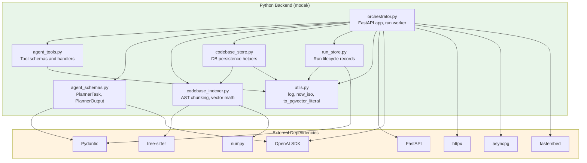
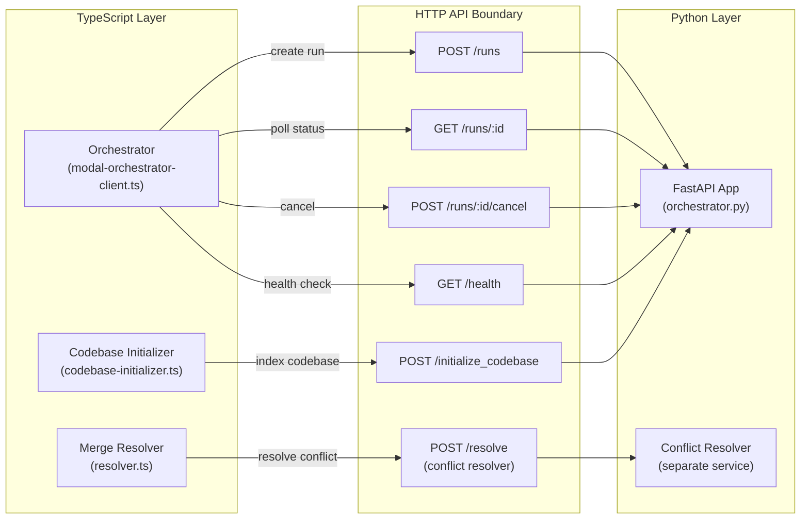

# Module Dependencies

This document maps the dependency relationships between all modules in the Overmind project. Arrows indicate "depends on" / "imports from".

## TypeScript Layer Dependencies

```mermaid
flowchart TD
    subgraph ENTRY["Entry Point"]
        CLI["src/cli.ts"]
    end

    subgraph SHARED["Shared Layer (zero side effects)"]
        PROTOCOL["protocol.ts\nZod schemas, parsers"]
        CONSTANTS["constants.ts\nPorts, timeouts, env helpers"]
        INVITE["invite.ts\nInvite code encode/decode"]
        PROJECT_ID["project-id.ts\nDerives ID from git remote"]
    end

    subgraph SERVER["Server Layer"]
        INDEX["server/index.ts\nWebSocket server, party lifecycle"]
        PARTY["server/party.ts\nParty class, members, queue"]
        DB["server/db.ts\nPostgreSQL pool, schema DDL"]
        PROJ_STORE["server/project-store.ts\nFilesystem project records"]
        CB_INIT["server/codebase-initializer.ts\nSends files to orchestrator"]
    end

    subgraph EXECUTION["Execution Subsystem"]
        AGENT["execution/agent.ts\nLocal Gemini tool-calling loop"]
        SCOPE["execution/scope.ts\nGemini scope extraction"]
        TOOLS["execution/tools.ts\nWorkspaceContext, tool declarations"]
    end

    subgraph ORCHESTRATOR["Orchestrator Subsystem"]
        ORCH_INDEX["orchestrator/index.ts\nOrchestrator class"]
        FILE_SYNC["orchestrator/file-sync.ts\nPack files for remote"]
        FILE_LOCK["orchestrator/file-lock.ts\nFileLockManager"]
        MODAL_ORCH_CLIENT["orchestrator/modal-orchestrator-client.ts\nHTTP client to Python API"]
        MODAL_CLIENT["orchestrator/modal-client.ts\nHTTP client to Modal bridge"]
        ALLOWLIST["orchestrator/allowlist.ts\nPath allowlist matching"]
        HELPERS["orchestrator/helpers.ts\nSleep, summarize"]
        STAGES["orchestrator/stages.ts\nStage string constants"]
        RESULT["orchestrator/result.ts\nFileChange type, diff helpers"]
        WORKSPACE["orchestrator/workspace.ts\nWorkspaceFiles class"]
    end

    subgraph MERGE_SYS["Merge Subsystem"]
        MERGE_INDEX["merge/index.ts\nConflict resolution pipeline"]
        MERGE_RESOLVER["merge/resolver.ts\nModal inference for conflicts"]
        MERGE_TYPES["merge/types.ts\nShared types"]
    end

    subgraph STORY_SYS["Story Subsystem"]
        STORY["story/agent.ts\nStory agent, feature clustering"]
    end

    subgraph CLIENT_LAYER["Client Layer"]
        APP["ui/App.tsx\nState owner (useReducer)"]
        CONN["connection.ts\nWebSocket wrapper"]
        SESSION["session.ts\nHigh-level client API"]
        STATUS_BAR["ui/StatusBar.tsx"]
        PARTY_PANEL["ui/PartyPanel.tsx"]
        OUTPUT_VIEW["ui/OutputView.tsx"]
        EXEC_VIEW["ui/ExecutionView.tsx"]
        PROMPT_INPUT["ui/PromptInput.tsx"]
        REVIEW_PANEL["ui/ReviewPanel.tsx"]
        ACTIVITY_FEED["ui/ActivityFeed.tsx"]
        BADGE["ui/components/Badge.tsx"]
        DIFF_BLOCK["ui/components/DiffBlock.tsx"]
        SPINNER["ui/components/Spinner.tsx"]
    end

    %% CLI dependencies
    CLI --> INDEX
    CLI --> SESSION
    CLI --> APP
    CLI --> CONSTANTS
    CLI --> INVITE
    CLI --> PROJECT_ID
    CLI --> PROJ_STORE
    CLI --> CB_INIT
    CLI --> DB
    CLI --> STORY

    %% Server index dependencies
    INDEX --> PARTY
    INDEX --> PROTOCOL
    INDEX --> CONSTANTS
    INDEX --> PROJECT_ID
    INDEX --> ORCH_INDEX
    INDEX --> DB
    INDEX --> STORY
    INDEX --> MERGE_INDEX
    INDEX --> SCOPE
    INDEX --> AGENT

    %% Execution dependencies
    AGENT --> TOOLS
    AGENT --> CONSTANTS
    AGENT --> FILE_SYNC
    SCOPE --> CONSTANTS
    SCOPE --> FILE_SYNC

    %% Orchestrator dependencies
    ORCH_INDEX --> CONSTANTS
    ORCH_INDEX --> FILE_LOCK
    ORCH_INDEX --> FILE_SYNC
    ORCH_INDEX --> MODAL_ORCH_CLIENT
    ORCH_INDEX --> ALLOWLIST
    ORCH_INDEX --> HELPERS
    ORCH_INDEX --> STAGES
    ORCH_INDEX --> WORKSPACE
    ORCH_INDEX --> PROJECT_ID
    ORCH_INDEX --> RESULT
    FILE_SYNC --> CONSTANTS
    FILE_SYNC --> PROTOCOL
    FILE_LOCK --> CONSTANTS
    MODAL_ORCH_CLIENT --> CONSTANTS
    ALLOWLIST --> PROTOCOL
    WORKSPACE --> RESULT

    %% Merge dependencies
    MERGE_INDEX --> MERGE_RESOLVER
    MERGE_INDEX --> MERGE_TYPES

    %% Story dependencies
    STORY --> DB
    STORY --> PROJECT_ID
    STORY --> CONSTANTS

    %% Client dependencies
    SESSION --> CONN
    SESSION --> PROTOCOL
    SESSION --> CONSTANTS
    CONN --> PROTOCOL
    CONN --> CONSTANTS
    APP --> CONN
    APP --> SESSION
    APP --> PROTOCOL
    APP --> STATUS_BAR
    APP --> PARTY_PANEL
    APP --> OUTPUT_VIEW
    APP --> EXEC_VIEW
    APP --> PROMPT_INPUT
    APP --> REVIEW_PANEL
    APP --> ACTIVITY_FEED

    %% Shared dependencies
    PARTY --> PROTOCOL
    PARTY --> CONSTANTS
    CB_INIT --> CONSTANTS

    %% Styling
    style SHARED fill:#e8f5e9
    style ENTRY fill:#fff3e0
    style SERVER fill:#e3f2fd
    style EXECUTION fill:#e3f2fd
    style ORCHESTRATOR fill:#e3f2fd
    style MERGE_SYS fill:#e3f2fd
    style STORY_SYS fill:#e3f2fd
    style CLIENT_LAYER fill:#f3e5f5
```

## Python Layer Dependencies

## Cross-Layer Communication

## Dependency Rules and Layer Boundaries

1. **Shared layer** (`src/shared/`) has zero runtime side effects. It contains only Zod schemas, types, constants, and pure utility functions. Both server and client import from it.

2. **Server layer** (`src/server/`) never imports from client. The server only depends on shared and its own submodules.

3. **Client layer** (`src/client/`) never imports from server. It depends only on shared types and its own UI components.

4. **Python layer** (`modal/`) is completely decoupled from TypeScript at the code level. Communication happens exclusively over HTTP REST endpoints.

5. **Deploy layer** (`deploy/`) is standalone infrastructure code with no imports from the main codebase.

6. **Privacy invariant**: Prompt content (`PromptEntry.content`) flows only through:
   - server/index.ts (evaluation and execution)
   - server/story/agent.ts (DB storage and clustering)
   - server/execution/agent.ts (Gemini prompt)
   - orchestrator/index.ts (remote execution payload)
   It is NEVER included in broadcast messages, activity events, or PR descriptions.
