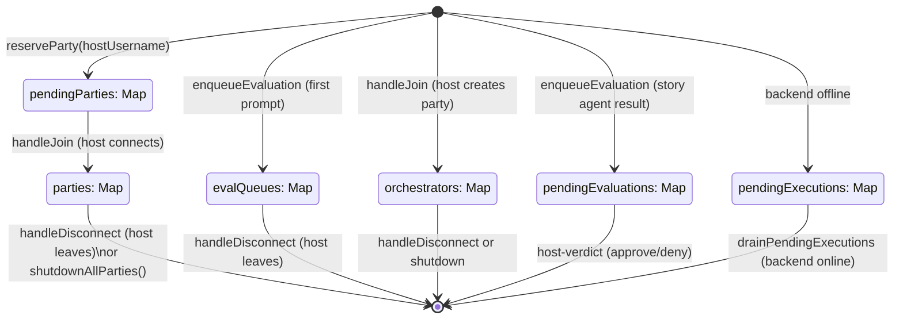
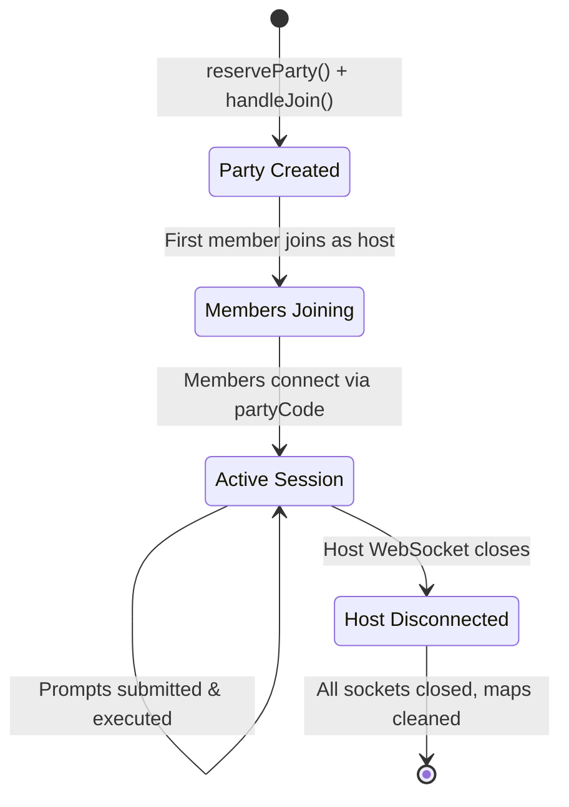
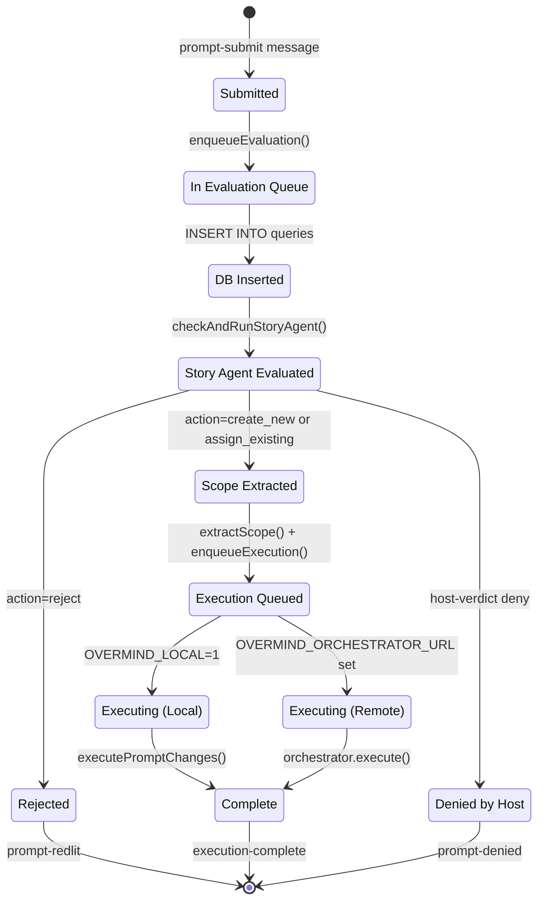
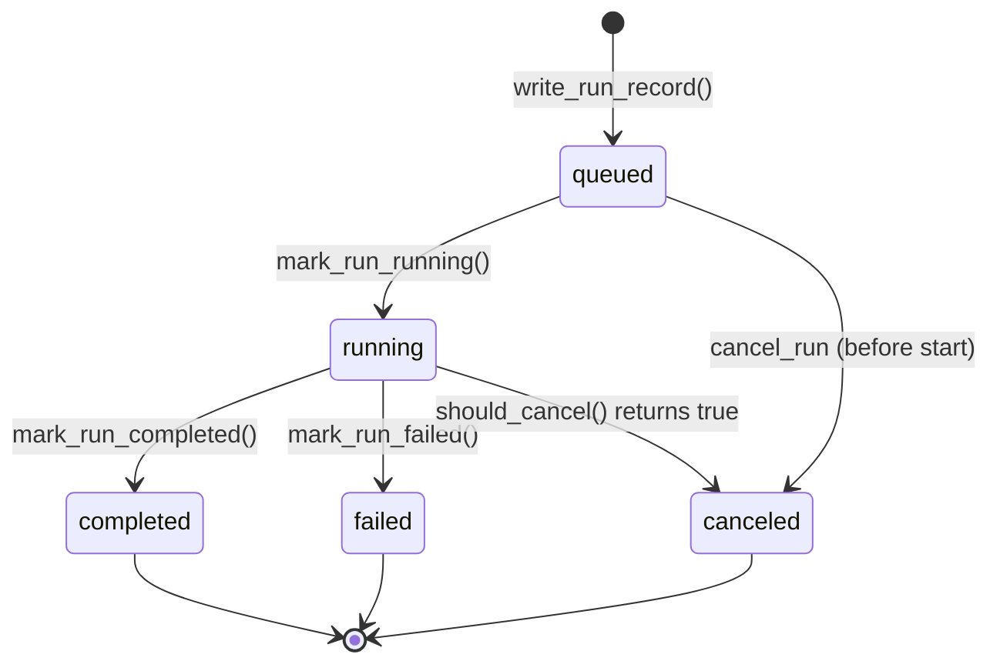
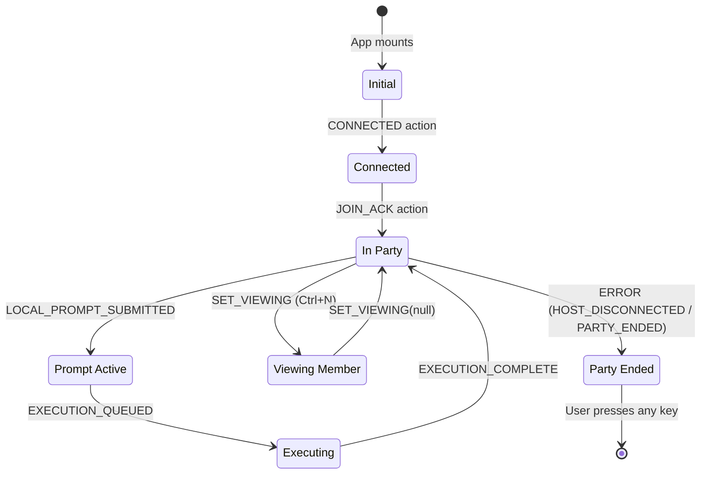
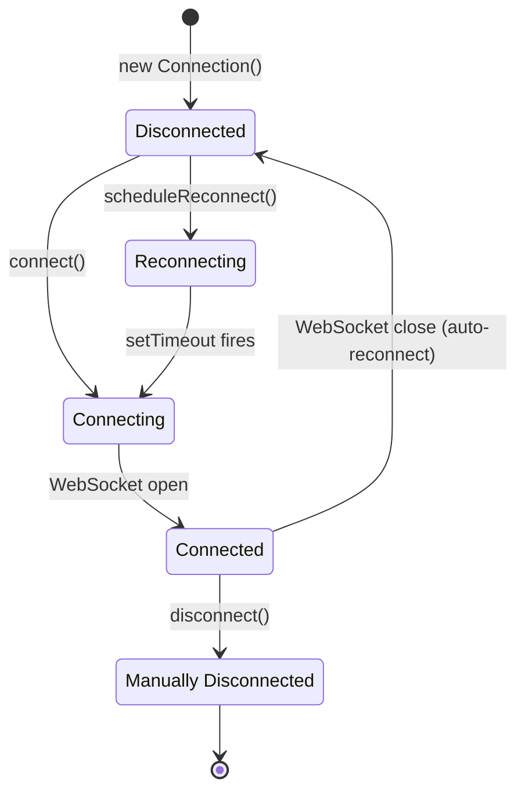

# State Variable Lifecycles

This document tracks all significant state variables across the Overmind system, their creation, mutation, and destruction points.

## Server-Side State Variables

### Module-Level State (src/server/index.ts)

These are the core server maps that track all active state.

### Party Lifecycle

### Prompt Lifecycle

### Run Store Record (Python: modal/run_store.py)

## Client-Side State Variables

### AppState Lifecycle (src/client/ui/App.tsx)

The entire TUI state is a single `useReducer` with immutable updates.

### Connection State (src/client/connection.ts)

## Key State Variable Catalog

| Variable | Location | Type | Persistence | Importance | Created | Modified | Destroyed |
|----------|----------|------|-------------|------------|---------|----------|-----------|
| `parties` | server/index.ts | Map<string, Party> | Session | Critical | reserveParty+handleJoin | addMember/removeMember | handleDisconnect/shutdown |
| `evalQueues` | server/index.ts | Map<string, Promise> | Session | Critical | enqueueEvaluation | Promise chaining | handleDisconnect |
| `orchestrators` | server/index.ts | Map<string, Orchestrator> | Session | Critical | handleJoin (host) | execute() | handleDisconnect/shutdown |
| `pendingEvaluations` | server/index.ts | Map<string, EvalResult> | Session | Important | enqueueEvaluation | n/a | host-verdict |
| `pendingExecutions` | server/index.ts | Map<string, PendingExec[]> | Session | Important | backend offline | push() | drainPendingExecutions |
| `executionBackendAvailable` | server/index.ts | boolean | Session | Critical | initBridge() | health checks | n/a |
| `bridgeProcess` | server/index.ts | ChildProcess | Session | Important | spawnBridgeProcess | n/a | process exit/shutdown |
| `party.members` | server/party.ts | Map<string, Member> | Session | Critical | constructor | addMember/removeMember | Party destroyed |
| `party.promptQueue` | server/party.ts | PromptEntry[] | Session | Critical | constructor | submitPrompt/getNextPrompt | Party destroyed |
| `fileLocks` | orchestrator/index.ts | FileLockManager | Session | Critical | constructor | tryAcquire/release | shutdown |
| `activeExecutions` | orchestrator/index.ts | Map<string, AgentExec> | Session | Important | trackExecution | n/a | cancel/shutdown |
| `context.changes` | execution/tools.ts | FileChange[] | Temporary | Critical | constructor | executeTool(write_file) | function return |
| `AppState` | client/ui/App.tsx | useReducer | Session | Critical | initialState | reducer dispatch | unmount |
| `_pool` | server/db.ts | pg.Pool | Session | Critical | getPool() | n/a | process exit |
| `db_pool` | modal/orchestrator.py | asyncpg Pool | Session | Critical | lifespan startup | n/a | lifespan shutdown |
| `_store._data` | modal/run_store.py | dict | Session (volatile) | Critical | _MemoryStore() | put() | process restart |
| `_embedding_model` | modal/orchestrator.py | TextEmbedding | Session | Important | _get_embedding_model() | n/a | process exit |
| `_active_tasks` | modal/orchestrator.py | set[asyncio.Task] | Session | Important | module load | add/discard | process exit |
| `_parser_cache` | modal/codebase_indexer.py | dict | Session | Supplementary | _make_parser() | n/a | process exit |
| `features` | PostgreSQL | table | Persisted | Critical | Story Agent create_new | n/a | n/a (no delete path) |
| `queries` | PostgreSQL | table | Persisted | Critical | enqueueEvaluation INSERT | UPDATE feature_id | DELETE on reject |
| `branches` | PostgreSQL | table | Persisted | Important | initialize_codebase | UPSERT | n/a |
| `code_chunks` | PostgreSQL | table | Persisted | Important | initialize_codebase | INSERT (ON CONFLICT skip) | CASCADE on branch delete |
| `~/.overmind/projects/*.json` | filesystem | JSON | Persisted | Important | loadOrCreateProjectRecord | n/a (read-only after create) | manual delete |
| `STORY.md` | filesystem | Markdown | Persisted | Important | generateInitialStory | regenerateStoryMarkdown | n/a |
