# System Overview

Overmind is a multiplayer AI coding terminal where multiple developers connect to a shared WebSocket session, submit coding prompts, and an AI execution pipeline modifies the host's project files on their behalf.

The system has three major layers: a TypeScript WebSocket server + CLI/TUI client, a Python FastAPI orchestrator backend, and a PostgreSQL database with pgvector for semantic code search. The host process runs both the WebSocket server and a local Ink/React TUI. Remote clients connect via WebSocket (optionally tunneled through ngrok).

## Style Conventions

- **Blue nodes**: TypeScript / Node.js layer
- **Green nodes**: Python / FastAPI layer
- **Orange nodes**: External services (database, LLM, SageMaker)
- **Purple nodes**: Client/TUI layer
- **Gray nodes**: Infrastructure / deployment

```mermaid
flowchart TB
    subgraph CLI["CLI Entry Point (src/cli.ts)"]
        HOST["overmind host"]
        JOIN["overmind join"]
    end

    subgraph TS_SERVER["TypeScript Server Layer"]
        direction TB
        WSS["WebSocket Server\n(src/server/index.ts)"]
        PARTY["Party Manager\n(src/server/party.ts)"]
        EVAL["Evaluation Queue\n(enqueueEvaluation)"]
        SCOPE["Scope Extractor\n(src/server/execution/scope.ts)"]
        LOCAL_AGENT["Local Gemini Agent\n(src/server/execution/agent.ts)"]
        TOOLS_TS["Workspace Tools\n(src/server/execution/tools.ts)"]
        ORCHESTRATOR["Remote Orchestrator Client\n(src/server/orchestrator/index.ts)"]
        FILE_SYNC["File Sync / Packer\n(src/server/orchestrator/file-sync.ts)"]
        FILE_LOCK["File Lock Manager\n(src/server/orchestrator/file-lock.ts)"]
        WORKSPACE["Workspace Files\n(src/server/orchestrator/workspace.ts)"]
        MODAL_CLIENT["Modal Orchestrator Client\n(HTTP client)"]
        MERGE["Merge Conflict Solver\n(src/server/merge/index.ts)"]
        RESOLVER["AI Conflict Resolver\n(src/server/merge/resolver.ts)"]
        STORY["Story Agent\n(src/server/story/agent.ts)"]
        DB_TS["DB Module (pg)\n(src/server/db.ts)"]
        PROJ_STORE["Project Store\n(src/server/project-store.ts)"]
        CB_INIT["Codebase Initializer\n(src/server/codebase-initializer.ts)"]
    end

    subgraph CLIENT["Client / TUI Layer"]
        direction TB
        APP["App Component\n(src/client/ui/App.tsx)"]
        CONN["Connection\n(src/client/connection.ts)"]
        SESS["Session\n(src/client/session.ts)"]
        UI_PANELS["UI Panels\nStatusBar, PartyPanel\nOutputView, ExecutionView\nPromptInput, ReviewPanel\nActivityFeed"]
    end

    subgraph PYTHON_BACKEND["Python FastAPI Backend (modal/)"]
        direction TB
        ORCH_PY["Orchestrator API\n(modal/orchestrator.py)"]
        PLANNER["Planner Agent\n(run_planner)"]
        SUBAGENT["Subagent Loop\n(subagent_loop)"]
        AGENT_TOOLS["Agent Tools\n(modal/agent_tools.py)"]
        INDEXER["Codebase Indexer\n(modal/codebase_indexer.py)"]
        CB_STORE["Codebase Store\n(modal/codebase_store.py)"]
        RUN_STORE["Run Store\n(modal/run_store.py)"]
        SCHEMAS["Agent Schemas\n(modal/agent_schemas.py)"]
    end

    subgraph EXTERNAL["External Services"]
        POSTGRES[("PostgreSQL + pgvector\nfeatures, queries,\nbranches, code_chunks")]
        GEMINI["Gemini API\n(scope, story, local agent)"]
        LLM["OpenAI-compatible LLM\n(remote agent execution)"]
        SAGEMAKER["AWS SageMaker\n(Qwen model hosting)"]
        NGROK["ngrok TCP Tunnel"]
        GITHUB["GitHub API\n(PR creation)"]
        FASTEMBED["fastembed\nBAAI/bge-large-en-v1.5"]
    end

    subgraph DEPLOY["Deploy Infrastructure"]
        DEPLOY_SM["deploy_sagemaker.py"]
        LAMBDA["Lambda Endpoint Killer\n(budget alarm handler)"]
    end

    %% CLI connections
    HOST --> WSS
    HOST --> SESS
    JOIN --> SESS

    %% Client connections
    SESS --> CONN
    CONN -->|WebSocket| WSS
    SESS --> APP
    APP --> UI_PANELS

    %% Server internal
    WSS --> PARTY
    WSS --> EVAL
    EVAL --> STORY
    EVAL --> SCOPE
    SCOPE --> GEMINI
    EVAL -->|local mode| LOCAL_AGENT
    LOCAL_AGENT --> TOOLS_TS
    LOCAL_AGENT --> GEMINI
    EVAL -->|remote mode| ORCHESTRATOR
    ORCHESTRATOR --> FILE_SYNC
    ORCHESTRATOR --> FILE_LOCK
    ORCHESTRATOR --> WORKSPACE
    ORCHESTRATOR --> MODAL_CLIENT
    MODAL_CLIENT -->|HTTP| ORCH_PY
    WSS --> MERGE
    MERGE --> RESOLVER
    RESOLVER -->|HTTP| LLM
    MERGE --> GITHUB
    STORY --> GEMINI
    STORY --> DB_TS
    DB_TS --> POSTGRES
    HOST --> PROJ_STORE
    HOST --> CB_INIT
    CB_INIT -->|HTTP| ORCH_PY

    %% Python backend internal
    ORCH_PY --> PLANNER
    ORCH_PY --> SUBAGENT
    PLANNER --> LLM
    SUBAGENT --> AGENT_TOOLS
    SUBAGENT --> LLM
    AGENT_TOOLS -->|semantic_search| POSTGRES
    AGENT_TOOLS --> FASTEMBED
    ORCH_PY --> RUN_STORE
    ORCH_PY --> INDEXER
    ORCH_PY --> CB_STORE
    INDEXER --> FASTEMBED
    CB_STORE --> POSTGRES

    %% Deploy
    DEPLOY_SM --> SAGEMAKER
    LAMBDA --> SAGEMAKER
    LLM -.->|hosted on| SAGEMAKER

    %% Tunnel
    WSS -.-> NGROK
```

## Component Descriptions

| Component | Layer | Responsibility |
|-----------|-------|---------------|
| **CLI (cli.ts)** | Entry | Parses `host` and `join` commands, starts server or connects client |
| **WebSocket Server (server/index.ts)** | Server | Manages connections, party lifecycle, evaluation queue, execution dispatch |
| **Party (party.ts)** | Server | Tracks members, prompt queue, broadcast messaging |
| **Scope Extractor (scope.ts)** | Server | Uses Gemini to identify which files a prompt affects |
| **Local Agent (agent.ts)** | Server | Gemini tool-calling loop for direct file modifications |
| **Orchestrator (orchestrator/index.ts)** | Server | Remote execution coordinator: file locks, run lifecycle, polling |
| **File Sync (file-sync.ts)** | Server | Packs project files for remote sandbox execution |
| **Merge Solver (merge/index.ts)** | Server | Detects conflicts, resolves via AI, commits, opens PRs |
| **Story Agent (story/agent.ts)** | Server | Clusters prompts into features, maintains STORY.md |
| **DB Module (db.ts)** | Server | PostgreSQL connection pool, schema initialization |
| **FastAPI Orchestrator (orchestrator.py)** | Python | Run management, planner/subagent execution, codebase indexing |
| **Agent Tools (agent_tools.py)** | Python | Tool schemas and handlers: read, write, search, bash, network |
| **Codebase Indexer (codebase_indexer.py)** | Python | tree-sitter AST chunking, embedding generation |
| **App (App.tsx)** | Client | useReducer state management, server message routing |
| **Connection (connection.ts)** | Client | WebSocket wrapper with auto-reconnect |
| **Session (session.ts)** | Client | High-level client API: join, submit prompt, send verdict |
